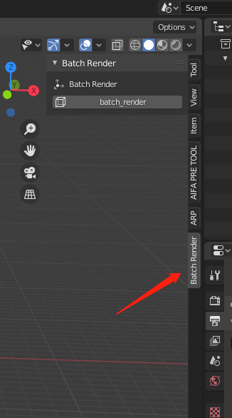
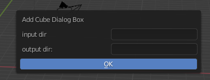

# blender_batch_render_addon
blender_batch_render_addon
this is simple blender batch render animation addon practice
# how to use  
1. install addon  

2. click batch render  

  
input dir means the fbxs dir  
output dir means the output video dir